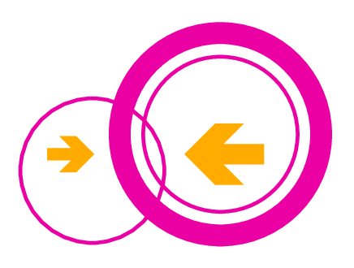
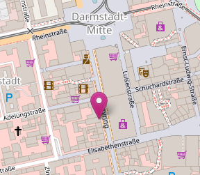

<div style="display: none;">
Pakete installieren
- curl
- iperf3
- batctl-full
- tmux
- iw-full
- ip-full
- vim
- odhcpd
- dmesg
- mtr
- batman-adv
- wpa-supplicant-mesh-openssl
- hostapd-openssl
- horst
- wavemon
- tcpdump
    
Pakete entfernen
- firewall
- dnsmasq
- luci
- ppp

config snippet

```bash
#! /bin/ash
ROUTER_ID=$1

uci set system.@system[0].hostname="Meshnode${ROUTER_ID}"
uci commit system

uci set network.lan.ipaddr="192.168.0.${ROUTER_ID}"
uci del network.lan.ip6assign
uci del network.wan
uci del network.wan6
uci commit network

# dhcpd
uci set dhcp.odhcpd.maindhcp='1'

uci del dhcp.lan
uci set dhcp.lan=dhcp
uci set dhcp.lan.dhcpv4='server'
uci set dhcp.lan.interface='lan'
uci set dhcp.lan.router='192.168.0.254'
uci add_list dhcp.lan.dns='192.168.0.254'
uci set dhcp.lan.start="$(($ROUTER_ID * 10))"
uci set dhcp.lan.limit='10'
uci commit dhcp

# wireless
uci del wireless.default_radio0
uci del wireless.default_radio1
uci commit wireless

reload_config
```
</div>

 

# Mesh-Netzwerke selber bauen

Ein Mesh-Netzwerk ist ein drahtloses Netzwerk aus WLAN-fähigen Geräten, die sich automatisch zu einem großen Gesamtnetzwerk zusammenschließen und darin autonom Routingentscheidungen treffen.

In diesem Hands-On bauen wir ein Solches Mesh-Netzwerk basierend auf batman-adv, einem Layer-2 Mesh-Protokoll. Das Mesh ermöglicht es Geräte untereinander flexibel zu verbinden und alle angeschlossenen Geräte im Mesh erreichbar zu machen, sei es durch direkte Nachbarschaft oder über Multi-Hop Verbindungen.

----
### 1. Mit Router per SSH verbinden

Auf dem bereitgestellten WLAN-Router läuft ein aktuelles OpenWrt. Die Geräte identifizieren sich über den Namen `Meshnode{1-8}`. Verbinde nun dein Laptop mit dem *gelben* LAN-Port des Routers. Auf dem Router läuft ein DHCP-Server, welcher angeschlossenen Geräten automatisch eine IPv4-Adresse zuweist.

Verbinde dich nun per SSH mit dem Router, die Zugangsdaten dafür lauten:
- IP-Addresse: *siehe Label auf der Oberseite des Routers*
- Benutzer: root
- Passwort: *keines*

Das geht unter Linux/BSD/Mac sowie unter Windows 10 mit dem `ssh` Befehl. Vorherige Versionen von Windows benötigen bspw. PuTTY.

```
# ssh root@192.168.0.1
            
BusyBox v1.28.3 () built-in shell (ash)

  _______                     ________        __
 |       |.-----.-----.-----.|  |  |  |.----.|  |_
 |   -   ||  _  |  -__|     ||  |  |  ||   _||   _|
 |_______||   __|_____|__|__||________||__|  |____|
          |__| W I R E L E S S   F R E E D O M
 -----------------------------------------------------
 OpenWrt 18.06-SNAPSHOT, r7391+11-0d549271d3
 -----------------------------------------------------
root@Meshnode1:~# 
```


#### 1.1 Mit mehr als einem Laptop zusammenarbeiten

Wenn ihr in eurer Gruppe mit mehr als einem Laptop teilnehmen möchtet empfehlen wir zum gemeinsamen Arbeiten den Terminal-Muxer`tmux` zu verwenden. Ist das nicht der Fall, überspringe das Kapitel 1.1 einfach.

Versuche zunächst einer vorhandenen tmux Session beizutreten:

```
# tmux attach
no sessions
```

Folgt die `no sessions` Meldung, ist keine Session offen und du kannst die erste Session öffnen:

```
# tmux
```

Tritt folgender Fehler auf, so musst du zunächst die `TERM`-Variable auf einen anderen Wert setzen:

```
# tmux attach
open terminal failed: missing or unsuitable terminal: rxvt-unicode-256color
# export TERM=xterm
# tmux
```

So können alle am Team beteiligten mitarbeiten und den Fortschritt verfolgen.

#### 1.2 OpenWrt Konfigurationsverwaltung mit UCI

In OpenWrt werden Einstellungen über die Konfigurationsschnittstelle UCI vorgenommen. Dabei stellt UCI Bibliotheken für Scripte, aber auch ein Kommandozeilenewerkzeug namens `uci` zur Verfügung. 

Um sich die vorhandene Konfiguration anzusehen, kann man einzelne Variablen oder ganze Konfigurationsblöcke abfragen.

```
# uci show [config]
# uci get config.section.option
```

Will man die Konfiguration ändern, so kann man neue Konfigurationsblöcke anlegen oder auch den Wert von Variablen verändern.

```
# uci add config section=type
# uci set config.section.option=value
```

Die Bedeutung der einzelnen Begriffe ist wie folgt:
- `config` eine Konfigurationsdatei in `/etc/config/`
- `section` ein Konfigurationsblock in dieser Datei
- `type` beschreibt die Funktion der `section`
- `option` ist der Name einer Variable
- `value` der zu konfigurierende Wert

Hat man eine Konfigurationsänderung getätigt, so ist diese zunächst nur temporär vorgemerkt. Alle noch nicht persistierten Änderungen kann man sich anzeigen lassen.

```
# uci changes
```

Ist man mit den gemachten Änderungen zufrieden, so perstitiert man diese und lässt die Änderungen anwenden.

```
# uci commit
# reload_config
```

Diese Schritte werden wir in den folgenden Abschnitten für verschiedene Konfigurationen anwenden.


----

### 2. Mesh über Mesh Point (11s) verbinden

Aus dem 802.11s Standard, der 2011 veröffentlicht wurde und erstmals Wireless Mesh-Netzwerke als IEEE-Standard beschreibt, nutzen wir das darin beschriebene Layer2-Protokoll.
Im Gegensatz zu AP/Station können hierbei beide Seiten die Verbindung initieren, was für ein Netzwerk autonomer Knoten sinnvoller ist.
Das in 802.11s integrierte Routingprotokoll HWRP (Hybrid Wireless Mesh Protocol) ist nicht für Kabelnetzwerke nutzbar, weshalb wir das interne Routingprotokoll deaktivieren und stattdessen batman-adv einsetzen.

#### 2.1 Finde und aktiviere das 5 GHz Radio

WLAN kann in Deutschland entweder auf dem 2.4 GHz oder auf dem 5-GHz-Band betrieben werden. Unseren Workshop-Aufbau betreiben wir ausschließlich im 5-GHz-Band. Das 5-GHz -Band verwendet Kanäle ab 36 bis 173.

Identifiziere zunächst das physische Radio (`radioN`), das auf dem 5 GHz Band operiert. Ein guter Indikator hierfür ist der `hwmode` (11a), sowie der eingestellte Kanal.

```
# uci show wireless
# uci set wireless.radio1.disabled='0'
# uci commit wireless
```

#### 2.2 Regulatory Domain prüfen

Bevor wir beginnen, teilen wir dem Router mit, welche regionale Funkregulierung anzuwenden ist.  Dabei werden Limits für die Sendeleistung, sowie Einschränkungen, welche Kanäle verwendet werden können, gesetzt.

Für uns in Deutschland gilt die Regulierung der ETSI, wir verwenden daher den Ländercode `DE`.

```
# uci set wireless.radio1.country='DE'
# uci commit wireless
```

#### 2.3 Mesh-Point Interface einrichten

An dieser Stelle konfigurieren wir ein Mesh-Point Interface. Hier muss das korrekte *physical radio* angegeben werden, allerdings im Format `phyN` (ohne `#`).

Die Mesh-ID ist der gemeinsame Identifier, den alle am Mesh teilnehmenden Geräte nutzen, um sich untereinander zu verbinden. Desweiteren können nur Geräte, die sich auf dem gleichen Kanal befinden sich in einem 802.11s Mesh untereinander austauschen, wähle daher die für dein Team passenden Einstellungen aus:

|           | Teams 1-5     | Team 6-10     |
|---------- | ------------- | ------------- |
| Mesh-ID   | Mesh-A        | Mesh-B        |
| Key       | kamikaze      | backfire      |
| Kanal     | 36 (5180 MHz) | 48 (5240 MHz) |
| HT-Mode   | HT20          | HT20          |

Stelle als erstes den richtigen Kanal auf dem Radio ein:

```
# uci set wireless.radio1.channel='<KANAL>'
```

Zunächst legen wir ein virtuelles Mesh-Interface auf `radio1` an.

```
# uci set wireless.mesh_radio1=wifi-iface
# uci set wireless.mesh_radio1.mode='mesh'
# uci set wireless.mesh_radio1.ifname='mesh1'
# uci set wireless.mesh_radio1.network='mesh1'
# uci set wireless.mesh_radio1.device='radio1'
```

Geräte finden sich über die gemeinsam verwendete Mesh-Id. Setze diese daher entsprechend der oben abgebildeten Tabelle.

```
# uci set wireless.mesh_radio1.mesh_id='<MESH-ID>'
```

Das integrierte Routingprotokoll HWRP deaktivieren wir wie folgt:

```
# uci set wireless.mesh_radio1.mesh_fwding='0'
```

Damit der Datenverkehr nicht unverschlüsselt übertragen wird, aktivieren wir die Verschlüsselung mittels SAE auf dem Interface

```
# uci set wireless.mesh_radio1.encryption='psk2+ccmp'
# uci set wireless.mesh_radio1.key='<KEY>'
```

Nun speichern wir die gemachten Änderungen in `wireless` und wenden sie schließlich an.

```
# uci commit wireless
# reload_config
```

Wir können nun in `logread` den Aufbau von verschlüsselten Meshverbindungen beobachten.

```
# logread
```

---
### 3. B.A.T.M.A.N. Adv Routing auf dem Wireless Mesh aktivieren

#### 3.1 Virtuelles bat0-Interface anlegen und ins LAN bridgen

Das `bat0`-Interface ist ein virtuelles Interface (im Folgenden auch Soft-Interface genannt), über welches die Enkapsulation von Layer2 Verkehr stattfindet. Das bedeutet, dass Daten die darüber übertragen werden, zvuor in Ethernet-Frames eingepackt werden, bevor diese weiterversendet werden.
Anschließend werden wir Hard-Interfaces für `bat0` konfigurieren, dabei handelt es sich dann um echte physische Links wie WLAN oder Kabel.

```
# uci set network.bat0=interface
# uci set network.bat0.proto='batadv'
# uci set network.bat0.routing_algo='BATMAN_V'
# uci set network.bat0.gw_mode='client'
# uci set network.bat0.fragmentation='1'
# uci commit network
```

#### 3.2 Mesh auf dem mesh1-Radio aktivieren
Konfiguriere `mesh1` nun als Hard-Interface für batman-adv. Ist das geschafft, wird batman-adv auf dem Interface nach Nachbarn suchen. Sobald der erste Nachbar gefunden wurde besteht eine Mesh-Verbindung.

```
# uci set network.mesh1='interface'
# uci set network.mesh1.ifname='mesh1'
# uci set network.mesh1.proto='batadv_hardif'
# uci set network.mesh1.master='bat0'
# uci set network.mesh1.mtu='1536'
# uci commit network
# reload_config
# /etc/init.d/network restart
```

#### 3.3 Nachbarschaft einsehen

Nun sucht batman-adv in regelmäßigen Abständen nach Nachbarn. Diese werden beim `BATMAN_V` Routing nach der Throughput-Metrik verwendet.

*Achtung:* Die Kopfzeilen in der folgenden Ausgabe sind in dieser Version von batctl leider verdreht, korrekt wäre die folgende Reihenfolge:

- **Neighbor** (MAC-Adresse des Nachbars)
- **last-seen** (Letzter Kontakt in Sekunden)
- **Throughput** (Erwarteter Datendurchsatz in Mbit/s)
- **IF** (Interface auf dem der Nachbar gefunden wurde)

```
# batctl neighbors
```

Außerdem erhälst Du von jedem Nachbarn Routen zu weiteren Geräten im Mesh-Netzwerk.
```
# batctl originators
```

##### 3.4 Quiz

Die eigene *primäre* MAC-Adresse im Mesh kannst Du der Kopfzeile von `batctl originators` entnehmen, sie folgt dem Label `MainIF/MAC`:

```
# batctl originators | head -n1
[B.A.T.M.A.N. adv 2018.1, MainIF/MAC: mesh0/XX:XX:XX:XX:XX:XX
 (bat0/f0:9f:c2:de:c4:c5 BATMAN_IV)]
```

Welche MAC-Adresse gehört zu welchem Team? Tauscht euch hierzu untereinander aus.

Team 1: `____:____:____:____:____:____`

Team 2: `____:____:____:____:____:____`

Team 3: `____:____:____:____:____:____`

Team 4: `____:____:____:____:____:____`

Team 5: `____:____:____:____:____:____`

Team 6: `____:____:____:____:____:____`

Team 7: `____:____:____:____:____:____`

Team 8: `____:____:____:____:____:____`

Gateway: `____:____:____:____:____:____`


Erreichst Du alle Knoten (im folgenden auch Originators genannt)? Wenn nein, warum nicht?

```
# batctl ping <MAC Address>
```

<br /><br /><br /><br /><br /><br />

Welche Knoten erreichst Du direkt, welche über benachbarte Knoten? Zeichne einen Graph, der die möglichen Pfade im Mesh abbildet.
```
# batctl traceroute <MAC address>
```

<br /><br /><br /><br /><br /><br /><br /><br /><br />

Welche Datenrate erreichst Du zu jedem Knoten im Mesh-Netzwerk deines Teams?
```
# batctl throughputmeter <MAC address>
```

Team __: `_____________ Mbit/s`   Team __: `_____________ Mbit/s`

Team __: `_____________ Mbit/s`   Team __: `_____________ Mbit/s`


----
### 4. Mesh ist unabhängig vom Transportweg

#### 4.1 Kabelverbindung herstellen

Mesh ist nicht an kabellose Kommunikationswege gebunden. So kann das Routing über beliebige Wege erfolgen, welche eine Ethernet-Verbindung bereitstellen.

Verbinde nun ein LAN-Kabel zwischen dem WAN-Port (blau) eines Routers aus dem Wireless-Mesh `Mesh-A` mit dem WAN-Port (blau) eines Routers aus `Mesh-B`.

#### 4.2 Mesh auf dem WAN-Interface aktivieren

Der Interface-Name des WAN-Ports ist bei den verwendeten Geräten `eth0.2`. Füge dieses nun als Mesh-Interface hinzu.

```
# uci set network.mesh_wan=interface
# uci set network.mesh_wan.proto='batadv_hardif'
# uci set network.mesh_wan.master='bat0'
# uci set network.mesh_wan.ifname='eth0.2'
# uci set network.mesh_wan.mtu='1536'
# uci commit network
# reload_config
```

#### 4.3 Nochmals die Nachbarschaft einsehen

Hat alles geklappt? Dann solltest du nun ebenfalls Mesh-Nachbarn auf `eth0.2` sehen. Übrigens kann man `neighbors` auch mit `n` abkürzen.

```
# batctl n
```

#### 4.4 Quiz

Was ist der Vorteil, wenn man Mesh über Kabelverbindungen aufbaut?

<br /><br /><br /><br /><br /><br />

Durch den Kabellink wurde das Mesh um die Router des anderen Teams erweitert. Mit welcher Geschwindigkeit erreicht ihr deren Router?

```
# batctl tp <MAC address>
```

Team __: `_____________ Mbit/s`   Team __: `_____________ Mbit/s`

Team __: `_____________ Mbit/s`   Team __: `_____________ Mbit/s`


----

### 5. IP-Netzwerk auf dem Mesh

Der Clou an Mesh-Netzwerken ist, dass man viele unterschiedliche Geräte auf unterschiedlichen Wegen zusammenstecken kann und dabei keine Schleifen erzeugt. Jeder weitere Link wird als Option für eine Routingentscheidung genutzt und steigert die Ausfallsicherheit.

Für den Betrieb eines Endnutzer-Netzwerkes sind allerdings viele weitere Komponenten notwendig, z.B.:
- DHCP/DHCPv6
- Router Advertisments
- DNS (Resolver & Authoritative)
- Firewall (Policies, NAT, MSS-Clamping)

#### 5.1 bat0-Interface ins LAN bridgen

Nun fügen wir `bat0` als Bridgeport in die LAN-Bridge ein. Das hat zur Folge, dass wir die auf der LAN-Bridge anliegende Geräte nun auch im Mesh erreichen können.

```
# uci add_list network.lan.ifname='bat0'
# uci commit network
# reload_config
```

#### 5.2 Quiz

Im Mesh-Netzwerk befindet sich auf der IP-Adresse `192.168.0.254` ein Gateway. Kannst du es anpingen? Kannst du die auf dem Webserver hinterlegte Webseite aufrufen?

```
# ping 192.168.0.254
# curl http://192.168.0.254/mesh.html
```

Kannst du dir das dort hinterlegte Video auf einem angeschlossenen Laptop ansehen? 

```
http://192.168.0.254/freifunk.mp4
```

An welchen Knoten ist das Gateway angeschlossen?

```
# batctl traceroute 192.168.0.254
```

Knoten: `___:___:___:___:___:___`

Welche Datenrate erreichst Du zum Gateway?

```
# iperf3 -c 192.168.0.254
```
Gateway: `_____________ Mbit/s`

Konfiguriere nun eine Default-Route über das Gateway und prüfe ob darüber das Internet erreichbar ist.

```
# uci set network.lan.gateway='192.168.0.254'
# uci commit network
# reload_config
# ip route show
default via 192.168.0.254 dev br-lan proto static
```

Kannst Du den Zielhost erreichen?

```
# ping 82.195.73.11
# traceroute -n 82.195.73.62
```

Kannst Du über das Mesh DNS-Namen auflösen? Auf dem Gateway läuft hierfür ein DNS-Resolver.

Trage hierzu zunächst das Gateway als DNS Server ein.

```
# uci add_list network.lan.dns="192.168.0.254"
# uci commit
# reload_config
```

Prüfe nun, ob du DNS Namen auflösen kannst.

```
# nslookup darmstadt.freifunk.net
```

---

### 6. Ausblick

Das war's! Ihr habt heute erfolgreich ein verschlüsseltes, hybrides Mesh-Netzwerk zusammengebaut. Die Ausbaustufen ab hier sind quasi beliebig. Wir hoffen dass der Workshop für euch genauso nützlich wie für uns unterhaltsam war.

#### 6.1 Wir sind Freifunk Darmstadt!

<div style="float: right">

</div>

Wenn wir mit Mesh-Netzwerken und Netzwerkinfrastruktur deine Interessen wecken konnten, dann bist Du bei Freifunk Darmstadt ganz richtig, denn wir bauen in Südhessen ein freies und offenes Mesh-Netzwerk auf. 
Dabei verzichten wir bewusst auf Zugangsbeschränkungen und Vorschaltseiten zugunsten der Barrierefreiheit. Als Grundlage dafür bauen wir eine eigene, auf OpenWrt-basierte Firmware für eine große Anzahl von Routern und betreiben die für ein Endnutzer-Netzwerk notwendige Serverinfrastruktur.

#### 6.2 Vortragsankündigungen

Wenn euch das Thema gefallen hat, laden wir euch hiermit auch zu unserem anstehenden Vortragsprogramm ein.

- Mo, 14. Oktober 2019, 20:30 Uhr
  **OpenWrt & Gluon: Wie entsteht unsere Firmware?**

- Mo, 11. November 2019, 20:30 Uhr
  **Infrastruktur: Wie funktioniert ein Freifunk-Netzwerk?**

#### 6.3 Wann und wo?

<div style="float: right;">

</div>

Wir treffen uns immer am **zweiten Montag im Monat, 
ab 19:00 Uhr** in den Räumen des Chaos Computer Club Darmstadt e.V., Wilhelminenstr. 17, wenige Gehminuten vom Luisenplatz.

Unsere Webseite findet ihr unter **https:/<span></span>/darmstadt.freifunk.net**.

<br /><br /><br /><br />
#### 6.4 Weitere Events des CCC Darmstadt e.V.

Der Hackspace des *Chaos Computer Club Darmstadt e.V.* ist Plattform für eine Vielzahl weiterer Events.

<div style="float: left; margin-right: 30px;">

</div>
<br>

- Hacktoberfest (am 19.10.)
- Offener Chaostreff (Di/Fr)
- CTF-Team (Mi)
- FINT* Stammtisch (rotierend)
  (Stammtisch für Frauen, non-binary, inter und trans* Personen)

<div>
    <br /><br />
    Weitere Infos unter <b>https:/<span></span>/www.chaos-darmstadt.de/termine.html</b>
</div>div>

