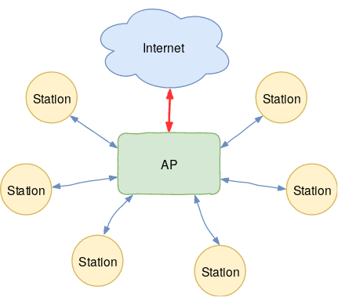
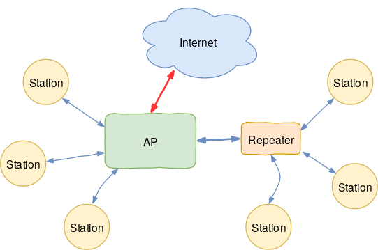
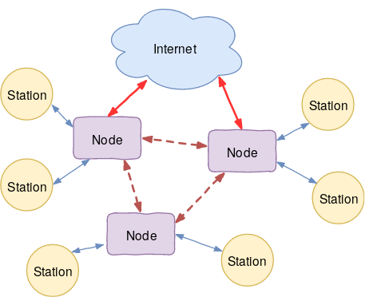

# Mesh-Netzwerke selbst gebaut
Workshop in der Informatik Ophase 2019

---

## Herzlich Willkommen!

---

## Wer sind wir?

---

## Mesh? Was ist das eigentlich?

---

## Access Point

---

## Repeater

---

## Mesh

---

## Routing

Bestimmung des besten Weges für Datenpakete

---

## Netzwerk-Layer

Festlegung verschiedener Schichten zur Datenübermittlung

---

## Netzwerk-Layer

---

# Hands-On

---

## Wir freuen uns auf euch!

---

## Wir freuen uns auf euch!

**Immer am zweiten Montag im Monat ab 19:00**
Nächste Treffen: 14.10., 11.11., 9.12.

**Wilhelminenstr. 17 (CCC Darmstadt)**
Wenige Gehminuten vom Luisenplatz entfernt

---

## Kommendes Programm

### OpenWrt & Gluon: Wie entsteht unsere Firmware?
Mo, 14. Oktober 2019, 20:30 Uhr
(nach der Zentralen Erstsemesterbegrüßung)

### Infrastruktur: Wie funktioniert ein Freifunk-Netzwerk?
Mo, 11. November 2019, 20:30 Uhr

---

## Fragen? Ideen? Feedback?

